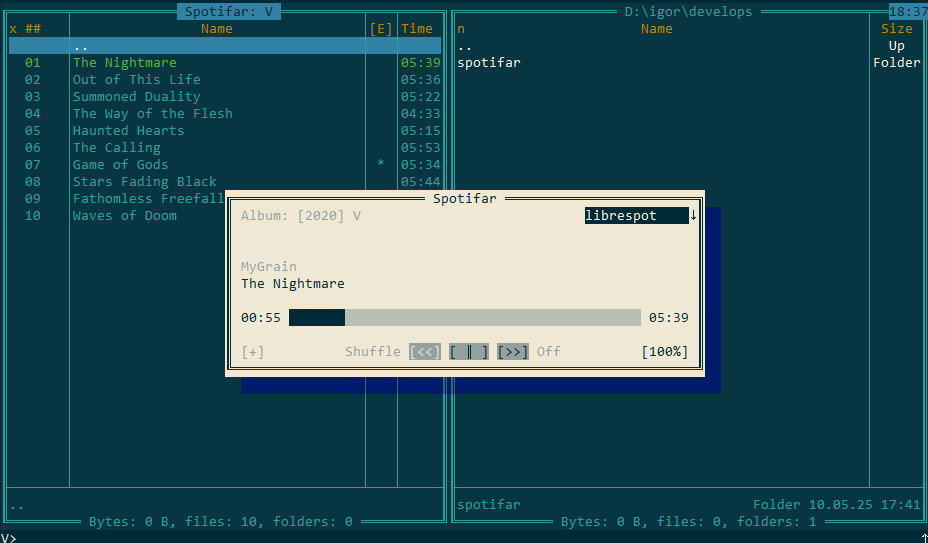

> [!WARNING]
> the project is slowly crawling to his first public release

# spotifar
Alternative Spotify client implementation via [Far Manager](https://github.com/FarGroup/FarManager) [plugin](https://www.farmanager.com/plugins.php). The plugin itself is just a UI facade for the [Spotify Web API](https://developer.spotify.com/documentation/web-api), using [Far Manager API](https://api.farmanager.com/) to draw panels and dialogs for a user to perform some basic manipulations with the current playback and his spotify collection.

# Rationale
- simple minimalistic way to control your music
- possibility to customize what you see in the app, on a contrary to the overloaded Spotify client
- global hotkeys support
- control and customize featuring releases and artists

# Prerequisites
### Spotify
For plugin to work as expected the user should have a Spotify account with active Premium subscription. Without one a playback functions will be forbidden, throwing 403 response. Beside the premium account, the user should obtain an authorisations token from [Spotify developers dashboard](https://developer.spotify.com/dashboard).
### Far Manager
For now, only [Far Manager](https://github.com/FarGroup/FarManager/releases) of version 3.0 and higher is supported.

# Limitations
Starting from November 27, 2024 Spotify [blocked](https://developer.spotify.com/blog/2024-11-27-changes-to-the-web-api) some of their web endpoints, mainly related to their internal algorythms. In practise for the third parties it means no accees to:
- all kind of recommendations and featurings: similar artists, freshly released albums, playlists created for you and etc.
- audio analysis features

# Quick start
### Installing plugin
1. Download plugin's [binaries](https://github.com/maliavko/spotifar/releases/)
2. Unpack the archive into your %FARHOME%\Plugins\ folder
3. If everything was right, you'll see a dedicated plugin's menu in the "Plugin Commands" dialogs in Far Manager (F11)
### Obtaining Spotify API tokens
1. Open a [Spotify developers dashboard](https://developer.spotify.com/dashboard)
2. Click "Create App" button, input your information
   - "App name" and "App description" are up to you
   - "Redirect URIs" - http://127.0.0.1:5000/auth/callback
   - "Which API/SDKs are you planning to use?" - pick "Web API" and "Web Playback SDK"
   - Consent an agreement with Spotify's terms and save your data
### Plugin configuration
1. Open up plugin's configuration dialog in Far Manager (Shift+Alt+F9) and select corresponded Spotifar option
2. In the dialog menu proceed with "General" option
3. In the "Spotify API" settings block input your freshly obtained "Client ID" and "Client Secret"
4. Leave "Port" data unchanged, or put the one you like, not forgetting to edit accordingly your callback url, used in the Spotify dashboard

# Compiling
[Details instruction](/COMPILING.md)

# Dependencies
Plugin uses the following great 3rd-parties, without which it wouldn't be even possible to think of this implementation:
- [cpp-httplib](https://github.com/yhirose/cpp-httplib) with [openssl](https://github.com/openssl/openssl) support - for executing all the http Spotify API requests
- [spdlog](https://github.com/gabime/spdlog) - for logging
- [bshoshany-thread-pool](https://github.com/bshoshany/thread-pool) - for parallelizing big collections fetching
- [rapidjson](https://github.com/Tencent/rapidjson) - for parsing and processing Spotify API responses data
- [wintoast](https://github.com/mohabouje/WinToast) - for showing up beautiful Windows tray notification toasts with the changing tracks and others
- [librespot](https://github.com/librespot-org/librespot) - for doing all the playback heavy lifting
- [ObserverManager](https://github.com/fnz/ObserverManager)
- [generator](https://github.com/lewissbaker/generator)

Thanks guys